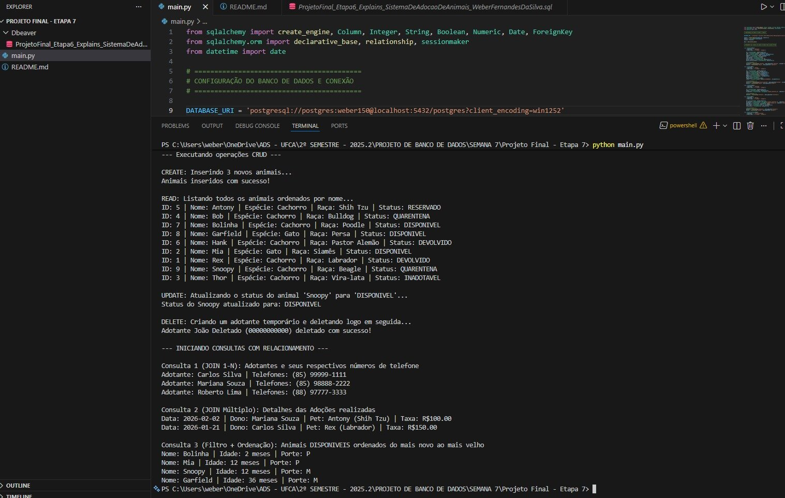

# Sistema de Adoção de Animais - Integração ORM (PostgreSQL + Python)

**Instituição:** Universidade Federal do Cariri (UFCA)  
**Curso:** Análise e Desenvolvimento de Sistemas (ADS)  
**Disciplina:** Projeto de Banco de Dados  
**Professor:** Prof. Jayr Alencar Pereira  
**Aluno:** Weber Fernandes da Silva  
**Matrícula:** 2025019356

Este projeto demonstra a integração de um banco de dados relacional PostgreSQL com uma aplicação Python utilizando o ORM SQLAlchemy, correspondente à etapa final da disciplina de Projeto de Banco de Dados.

## 🛠️ Tecnologias Utilizadas
- Python 3.13
- PostgreSQL
- SQLAlchemy (ORM)
- psycopg2-binary (driver de conexão com PostgreSQL)

## 📁 Estrutura de Pastas do Projeto

```text
Projeto Final - Etapa 7/
├── main.py
├── README.md
├── Dbeaver/
│   └── SistemaDeAdocaoDeAnimais.sql
└── images/
    └── terminal.jpg
```

### Descrição rápida dos arquivos
- `main.py`: código principal da aplicação em Python com integração ORM.
- `Dbeaver/SistemaDeAdocaoDeAnimais.sql`: script SQL para criação e carga inicial do banco.
- `images/terminal.jpg`: imagem de demonstração da execução do projeto.

## 📌 Pré-requisitos e Configuração do Banco
1. O PostgreSQL deve estar em execução localmente na porta `5432`.
2. Execute o script SQL (`Dbeaver/SistemaDeAdocaoDeAnimais.sql`) no DBeaver para criar o schema `exemplo` e popular as tabelas.
3. No arquivo `main.py`, altere a variável `DATABASE_URI`, substituindo `sua_senha` pela senha real do usuário `postgres`.

## 🚀 Como Executar o Projeto

1. Instale as dependências:

```bash
pip install sqlalchemy psycopg2-binary
```

2. Execute a aplicação:

```bash
python main.py
```

## 🖼️ Demonstração

Imagem de demonstração da execução no terminal:

